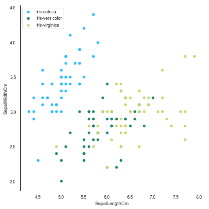
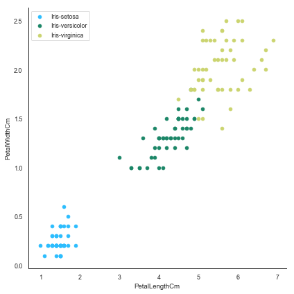
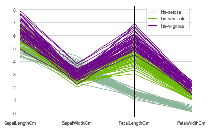
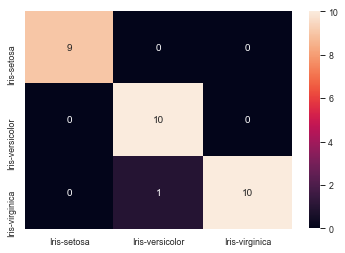

# Logistic Regression From Scratch
Implementing logistic regression from scratch on Iris data

## Introduction

Similar to linear regression, logistic regression can also be prone to overfitting if there are large number of features. If the decision boundary is overfit, the shape might be highly contorted to fit only the training data while failing to generalise for the unseen data.

So, the cost function of the logistic regression is updated to penalize high values of the parameters and is given by,


Where 

*  is the *regularization term*
*  is the *regularization factor*

Since this cost function accounts for a new regularization term, the derivative of the cost function must also account for this. Thus we have,


We can use these functions to make predictions on our data.

## Dataset

The data set I chose to implement this regression model was the [Iris dataset](https://www.kaggle.com/uciml/iris). It includes three iris species with 50 samples each as well as some properties about each flower. One flower species is linearly separable from the other two, but the other two are not linearly separable from each other.

### Visualizations

To get a sense of the data before implementing any sort of regression analysis, let's visualize it first.







### Implementation

```
#Logistic Regression

def sigmoid(z):
    return 1.0 / (1 + np.exp(-z))

#Regularized cost function
def regCostFunction(theta, X, y, _lambda = 0.1):
    m = len(y)
    h = sigmoid(X.dot(theta))
    reg = (_lambda/(2 * m)) * np.sum(theta**2)

    return (1 / m) * (-y.T.dot(np.log(h)) - (1 - y).T.dot(np.log(1 - h))) + reg

#Regularized gradient function
def regGradient(theta, X, y, _lambda = 0.1):
    m, n = X.shape
    theta = theta.reshape((n, 1))
    y = y.reshape((m, 1))
    h = sigmoid(X.dot(theta))
    reg = _lambda * theta /m

    return ((1 / m) * X.T.dot(h - y)) + reg

#Optimal theta 
def logisticRegression(X, y, theta):
    result = op.minimize(fun = regCostFunction, x0 = theta, args = (X, y),
                         method = 'TNC', jac = regGradient)
    
    return result.x
```    

After training our data, we find that the test accuracy yields a result of `96.667%` accuracy. We also have the following confusion matrix.



And that's my implementation of logistic regression from scratch. You can execute the code yourself in the jupyter notebook included in the repository.
